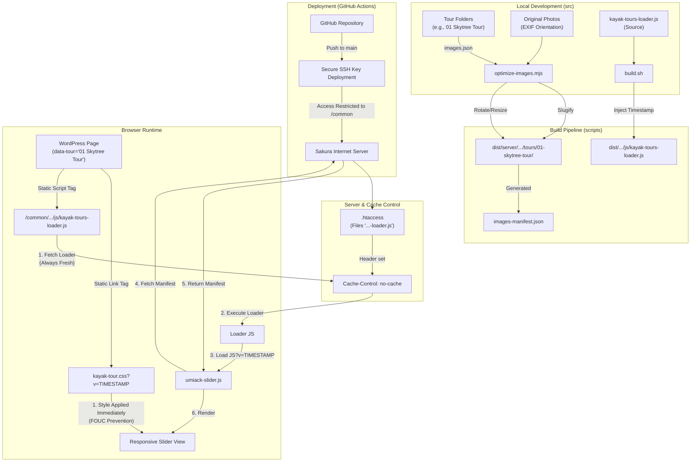

# Umiack Web Common Repository

このリポジトリは、Umiackのカヤックツアー等のWebサイト向け共通アセット、WordPress用HTML/CSS、および高度な画像最適化パイプラインを管理するためのものです。

---

## 🛠 技術設計図 (System Architecture)

このプロジェクトのデータフローとキャッシュ自動管理の仕組みを以下に示します。



---

## 💎 プロジェクトの管理・設計原則 (Core Principles)

### 1. ロジックとドキュメントの完全分離 (Separation of Logic and Docs)
*   **「動くコード」は独立したファイルで管理**: Apache設定、JavaScript、HTMLテンプレートなどはすべて `src/` 内の独立したファイルとして管理し、Gitで変更履歴を完全に追跡します。
*   **READMEはマニュアルに徹する**: `README.md` に直接プログラムのロジックを書き込まず、マニュアルとしての読みやすさと、システムとしての堅牢性を両立させます。

### 2. ソースアセットの不変性 (Source Invariance)
*   **`src/` 内のオリジナル画像は絶対に直接加工しません。**
*   撮影時の回転、色調などはそのままの状態で保管します（非破壊管理）。
*   フォルダ名は `01 Skytree Tour` のように、人間にとって読みやすく管理しやすい名前を付けます。

### 3. 公開用パスの自動Slug化 (Automated Slugification)
*   **フォルダ名とIDの完全一致**:
    *   `src/wordpress/Kayak Tours/` 下の**フォルダ名**と、HTMLの **`data-tour` 属性の値**は、表記を完全に一致させてください（大文字小文字・スペース含む）。
    *   例: フォルダ名が `Tokyo Skytree` なら、HTMLは `data-tour="Tokyo Skytree"` とします。
*   **URLへの自動変換**:
    *   ビルドプロセスにおいて、上記のリテラルな名前は、自動的にURLセーフな「Slug」に変換されます（例: `Tokyo Skytree` → `tokyo-skytree`）。

### 4. 外科的同期と物理的なアクセス制限 (Secure Surgical Sync)
*   **権限の最小化**: GitHub Actions にはサイト全体のパスワードではなく、専用の「SSH秘密鍵」のみを付与しています。
*   **物理的制限**: サーバー上の `authorized_keys` で実行制限をかけることで、**`common` ディレクトリ以外への操作を不可能**にしています。
*   **完全同期（--delete制限）**: デプロイ時にリポジトリの `dist/server/common/` とサーバーの `/common/` を比較し、**不要になった古いファイルを自動削除**してクリーンな状態を保ちます。この削除処理も `/common/` 内部に完全に限定されるため安全です。

### 5. CSS標準化設計規約 (CSS Standardization)
ツアーページ全体のルック＆フィールを統一し、堅牢な表示を実現するための規約です。
*   **垂直配置の統一 (.tour-container)**:
    *   全ツアーページは `.tour-container` でラップします。
    *   `display: flex; flex-direction: column; gap: 32px;` を設定し、垂直方向の余白を **32px** に完全に統一します。
*   **マージン・リセット則**:
    *   `section`, `.intro-paragraph`, `.tour-info-box` など、`.tour-container` の直下に来るすべての要素は、自らマージンを持たず、親の `gap` 設定に従います（`margin: 0;` または `margin: 0 auto;`）。
*   **YouTube表示の堅牢化**:
    *   動画の角丸（`border-radius`）や影（`box-shadow`）といった装飾は、コンテナ側ではなく **`iframe` 自体** に適用します。
    *   これにより、WordPressやテーマが挿入する余計なラッパー要素の影響を受けず、常に安定したプロフェッショナルな外観を維持します。

### 6. 自動キャッシュバスティング (Automated Cache Busting)
「一度設定したら二度とWordPress側を触らない」ことをゴールとした、二段階のキャッシュ管理システムです。
*   **ティア1：Loader（読み込み指示役）**:
    *   ローダー本体（`kayak-tours-loader.js`）は、専用の[設定ファイル](file:///Users/ryota/Documents/Business/My%20business/umiack/Web/common-repository/src/server/common/umiack-site-assets/js/.htaccess)で `Cache-Control: no-cache` を設定。
    *   ブラウザは毎回必ずサーバーへ「内容の変更」を確認するため、常に最新の読み込み指示が実行されます。
*   **ティア2：HTML内 CSSリンク (FOUC防止)**:
    *   表示の乱れ（Flash of Unstyled Content）を防ぐため、CSSはHTML冒頭の `<link>` タグで直接読み込みます。
    *   ビルド時に HTML内の `BUILD_VERSION` プレースホルダーをタイムスタンプに置換し、キャッシュを強制クリアします。
*   **ティア3：実資産（JS）**:
    *   Loaderが読み込む `umiack-slider.js` 等のURLに、ビルド時のタイムスタンプを自動付与（`?v=YYYYMMDDHHMM`）。

### 7. スライダー・コンポーネント設計 (Slider Architecture v4.0)
複数画像のスライダーと単一画像の表示を、全く同じHTMLコードで統一的に管理します。
*   **ゼロ・ボイラープレート**:
    *   HTMLには `<div class="umiack-slider-wrap" data-tour="フォルダ名" data-slider="サブ名"></div>` の1行を記述するだけです。
    *   矢印ボタン、ドットナビゲーション、画像コンテナ、拡大用モーダルなどの複雑なDOM要素は、すべてJavaScript（`umiack-slider.js`）が自動生成します。
*   **単一画像のスマート表示**:
    *   読み込んだ画像が**1枚のみ**だった場合、JavaScriptが自動的にスライド用の矢印やドットを非表示（生成スキップ）にします。
    *   これにより、1枚の時は「美しい単体画像」として、複数枚の時は「スライダー」として、一つのコードで完璧に動作します。

### 8. パーマリンク資産化と301永久転送 (Short Permalinks & 301 Redirects)
利便性とSEO向上のため、日付入りの長いURLを短いパーマリンク（`/skytree/` 等）に統合し、旧URLからは恒久的な転送を行います。
*   **ドメイン別管理**: サーバー構成に合わせ、`src/server/[domain]/[path]/` 階層でリダイレクト設定を管理します。
*   **SEO評価の継承**: 一時的な302ではなく、恒久的な301転送を用いることで、検索エンジンの評価を新URLへ完全に引き継ぎます。

### 9. ドキュメントの自律同期 (Autonomous Documentation Sync)
大きなコード変更やアーキテクチャの修正を行った際、その動作が正常であることがユーザーによって確認された後、AI（Antigravity）は自律的に `README.md` および内部ナレッジベースを最新の状態に更新します。これにより、コードとドキュメントの乖離を永久に防ぎます。

### 10. トップページ・モジュール設計 (Top Page Modular Architecture)
UMIACK各サイト（umiack.com, umiackcoffee.com）のトップページは、保守性と拡張性を両立させるため、共通の「コア・ロジック」と差し替え可能な「ロゴ・モジュール」で構成されています。

*   **共通コア (Shared Base)**:
    *   `top-shared.js`: スクロール量（0.0〜1.0）の正規化や、モジュール登録システムを提供。
    *   `top-backgrounds.js`: スクロールに応じた背景動画・画像の切り替え、および水滴背景アニメーションを制御。
*   **差し替え可能なロゴ・モジュール (Logo Modules)**:
    *   各サイト固有の演出（Umiackの浮遊ロゴ、Coffeeの回転スピナー等）は独立した JS/CSS ファイルとして管理。
    *   `TopShared.registerLogoModule()` を介して共通コアに登録することで、共通のスクロールイベントを受け取ります。
*   **利点**:
    *   背景切り替えロジックを修正すると、全サイトに一括反映されます。
    *   新しいトップページを作る際は、ロゴ部分のモジュールだけを新規作成すれば、既存の高度な背景演出をそのまま利用できます。

---

## 🚀 自動化フロー (Automation Flow)

### 1. ローカル作業 (Your PC)
*   `src/` 内を整理し、`git push` する。重い画像圧縮などは一切不要です。

### 2. クラウド処理 (GitHub Actions)
1.  **ビルド**: `scripts/build.sh` を実行。
    *   **画像最適化**: `sharp` を用いた WebP 変換とマルチサイズ展開。
    *   **資産圧縮**: `lightningcss`, `esbuild` による CSS/JS の軽量化。
    *   **バージョン注入**: `kayak-tours-loader.js` 内の `BUILD_VERSION` を現在時刻に一括置換。
2.  **デプロイ**: 成果物（`dist`）をさくらインターネットへ送信。
3.  **外科的同期**: `--delete` オプションにより、`/common/` 領域内にある不要な古いファイルを自動検知して安全に完全削除。

### 3. フロントエンド実行 (Browser)
*   WordPress側が読み込んだ `kayak-tours-loader.js` が、その瞬間の最新のCSS/JSを芋づる式にロード。
*   `data-tour` 属性を基に適切な画像を特定し、レスポンシブスライダーをレンダリング。

---

## 🛠 運用・管理 (Management)

### WordPress への初期設定
1.  **カスタムHTML**: `dist/wordpress/` 下の各 HTML ファイルの内容を貼り付けます。冒頭の `<link>` タグを含めることで、スタイルが即座に適用されます。
2.  **カスタムJavaScript**: 以下の **1行だけ** を設定してください。一度記述すれば、二度と変更する必要はありません。

```javascript
(function(d){var s=d.createElement('script');s.src='/common/umiack-site-assets/js/kayak-tours-loader.js';s.defer=true;d.head.appendChild(s);})(document);
```

### 開発環境
*   **依存関係**: Node.js v20+, `sharp`, `lightningcss`, `esbuild`, `html-minifier-terser`
*   **ビルドコマンド**: `./scripts/build.sh`

---

## 📂 クイックリファレンス (Key Files Map)

管理・修正時に頻繁に使用するファイルの場所です。

*   **サーバー設定・リダイレクト管理**
    *   [日本語版：リダイレクト設定 (jp.umiack.com)](file:///Users/ryota/Documents/Business/My%20business/umiack/Web/common-repository/src/server/jp.umiack.com/wp/redirects.htaccess-fragment)
    *   [グローバル版：リダイレクト設定 (umiack.com)](file:///Users/ryota/Documents/Business/My%20business/umiack/Web/common-repository/src/server/umiack.com/wp/redirects.htaccess-fragment)
    *   [ローダーのキャッシュ設定 (.htaccess)](file:///Users/ryota/Documents/Business/My%20business/umiack/Web/common-repository/src/server/common/umiack-site-assets/js/.htaccess)
*   **共通アセット (Logic & Style)**
    *   [共通CSS (Look & Feel)](file:///Users/ryota/Documents/Business/My%20business/umiack/Web/common-repository/src/server/common/umiack-site-assets/css/kayak-tour.css)
    *   [スライダーエンジン](file:///Users/ryota/Documents/Business/My%20business/umiack/Web/common-repository/src/server/common/umiack-site-assets/js/umiack-slider.js)

## 🌐 標準ツアーURL (Standard Tour URLs)
SNSやプロモーションで使用する、最新の資産URLリストです。

| ツアー名 | 日本語版 (jp.umiack.com) | グローバル版 (umiack.com) |
| :--- | :--- | :--- |
| **スカイツリー** | `/skytree/` | `/skytree/` |
| **日本橋** | `/nihonbashi/` | `/nihonbashi/` |
| **小名木川** | `/onagi/` | `/onagi/` |
| **お花見** | `/ohanami/` | `/ohanami/` |
| **高尾山** | `/cafe-takao/` | - |
| **大菩薩嶺** | `/cafe-daibosatsu/` | - |
*   **WordPress・コンテンツ**
    *   [WP貼り付け用コード (Loader Snippet)](file:///Users/ryota/Documents/Business/My%20business/umiack/Web/common-repository/src/wordpress/Kayak%20Tours/custom.js)
    *   [ツアーページ・テンプレート](file:///Users/ryota/Documents/Business/My%20business/umiack/Web/common-repository/src/wordpress/Kayak%20Tours/template_tour_main.html)
*   **ビルド・パイプライン**
    *   [ビルド・スクリプト](file:///Users/ryota/Documents/Business/My%20business/umiack/Web/common-repository/scripts/build.sh)
    *   [画像最適化エンジン](file:///Users/ryota/Documents/Business/My%20business/umiack/Web/common-repository/scripts/optimize-images.mjs)
