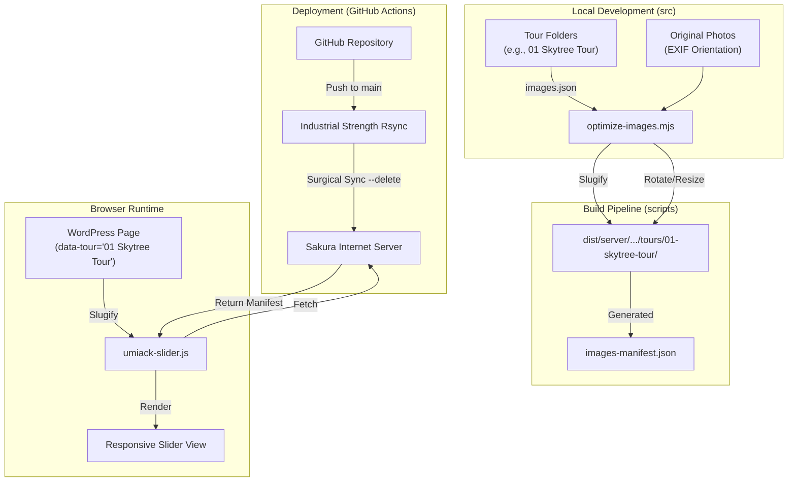

# Umiack Web Common Repository

このリポジトリは、Umiackのカヤックツアー等のWebサイト向け共通アセット、WordPress用HTML/CSS、および高度な画像最適化パイプラインを管理するためのものです。

---

## 🛠 技術設計図 (System Architecture)

このプロジェクトのデータフローと自動化の仕組みを以下に示します。

---

## 💎 プロジェクトの設計原則 (Iron Rules)

### 1. ソースアセットの不変性 (Source Invariance)
*   **`src/` 内のオリジナル画像は絶対に直接加工しません。**
*   撮影時の回転、色調などはそのままの状態で保管します（非破壊管理）。
*   フォルダ名は `01 Skytree Tour` のように、人間にとって読みやすく管理しやすい名前を付けます。

### 2. 公開用パスの自動Slug化 (Automated Slugification)
*   ビルドプロセスにおいて、フォルダ名は自動的にURLセーフな「Slug」に変換されます。
    *   例: `01 Skytree Tour` → `01-skytree-tour`
*   フロントエンド（スライダー）も同じルールでパスを解決するため、HTML側で人間用の名前を指定しても正しく画像が読み込まれます。

### 3. 外科的同期デプロイ (Surgical Sync)
*   GitHub Actions により、サーバー上の `/tours/` ディレクトリ内は常にリポジトリと同期されます。
*   `rsync --delete` を特定のディレクトリ（tours）に限定して実行することで、**他のサイトや共有アセットを危険にさらすことなく**、古いフォルダのみを自動的にお掃除します。

---

## 開発ガイド

### 画像の追加・更新
1.  ツアーフォルダ（例：`01 Skytree Tour`）の `img/` に写真を配置。
2.  `images.json` に写真のメタデータ（`alt`, `order`）を記述。
3.  `bash scripts/build.sh` を実行して、ローカルでビルドを確認。
4.  GitHub へ Push して自動デプロイを開始。

### ビルドとデプロイ
*   **ローカル実行**: `bash ./scripts/build.sh`
*   **デプロイ**: `main` ブランチへ Push すると、GitHub Actions が起動し、ビルドからサーバー同期までが全自動で実行されます。

## 依存関係
*   **Image Processing**: `sharp` (Node.js v20+)
*   **Deployment**: `sshpass`, `rsync`
