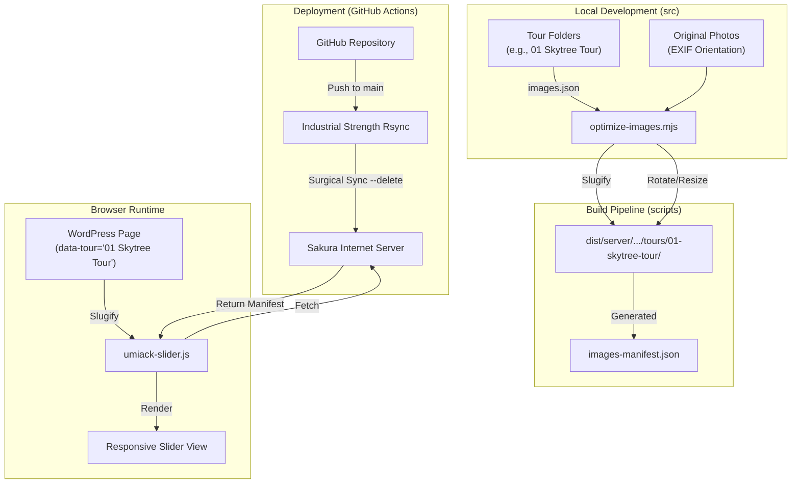

# Umiack Web Common Repository

このリポジトリは、Umiackのカヤックツアー等のWebサイト向け共通アセット、WordPress用HTML/CSS、および高度な画像最適化パイプラインを管理するためのものです。

---

## 🛠 技術設計図 (System Architecture)

このプロジェクトのデータフローと自動化の仕組みを以下に示します。

---

## 💎 プロジェクトの設計原則 (Iron Rules)

### 1. ソースアセットの不変性 (Source Invariance)
*   **`src/` 内のオリジナル画像は絶対に直接加工しません。**
*   撮影時の回転、色調などはそのままの状態で保管します（非破壊管理）。
*   フォルダ名は `01 Skytree Tour` のように、人間にとって読みやすく管理しやすい名前を付けます。

### 2. 公開用パスの自動Slug化 (Automated Slugification)
*   **フォルダ名とIDの完全一致**:
    *   `src/wordpress/Kayak Tours/` 下の**フォルダ名**と、`tour_main.html` の **`data-tour` 属性の値**は、表記を完全に一致させてください（大文字小文字・スペース含む）。
    *   例: フォルダ名が `Tokyo Skytree` なら、HTMLは `data-tour="Tokyo Skytree"` とします。
*   **URLへの自動変換**:
    *   ビルドプロセスにおいて、上記のリテラルな名前は、自動的にURLセーフな「Slug」に変換されます。
    *   例: `Tokyo Skytree` → `tokyo-skytree`
*   フロントエンド（スライダー）も実行時に同じルールでSlug化を行ってパスを解決するため、開発者は人間用の名前だけを意識すれば良くなっています。

### 3. 外科的同期デプロイ (Surgical Sync)
*   GitHub Actions により、サーバー上の `/tours/` ディレクトリ内は常にリポジトリと同期されます。
*   `rsync --delete` を特定のディレクトリ（tours）に限定して実行することで、**他のサイトや共有アセットを危険にさらすことなく**、古いフォルダのみを自動的にお掃除します。

---

## 🚀 自動化フロー (Automation Flow)

このプロジェクトは「人間は素材を整えるだけ、重い作業はクラウドに任せる」という分担で自動化されています。

### 1. ローカル作業 (Your PC)
*   `src/` 内に画像を追加し、`images.json` を整える。
*   Git で `push` する。
*   **ポイント**: あなたのPCで重い画像圧縮をする必要はありません（素材だけ送ればOKです）。

### 2. クラウド処理 (GitHub Actions)
`git push` をトリガーに、以下の作業がクラウド上で全自動実行されます。
1.  **環境構築**: Node.js 実行環境をセットアップ。
2.  **ビルド（重い作業）**: `scripts/build.sh` を実行し、以下の処理を一括で行う。
    *   **Slug化**: フォルダ名をURLセーフ（小文字・ハイフン）に変換。
    *   **画像処理**: EXIF回転の自動補正、WebPへの変換、各種サイズへのリサイズ。
    *   **マニフェスト生成**: スライダー用の `images-manifest.json` を作成。
3.  **デプロイ**: 出来上がった成果物（`dist`）をさくらインターネットへ送信。
4.  **外科的同期**: サーバー上の `tours/` ディレクトリ内をチェックし、リポジトリに存在しない古いフォルダを自動的に削除。

### 3. フロントエンド実行 (Browser)
*   HTMLの `data-tour` 属性を読み取る。
*   自動Slug化ロジックを用いて、サーバー上の正しいパスを特定。
*   画像を読み込み、レスポンシブスライダーをレンダリング。

---

## 開発ガイド (Development Guide)
...

## 依存関係
*   **Image Processing**: `sharp` (Node.js v20+)
*   **Deployment**: `sshpass`, `rsync`
